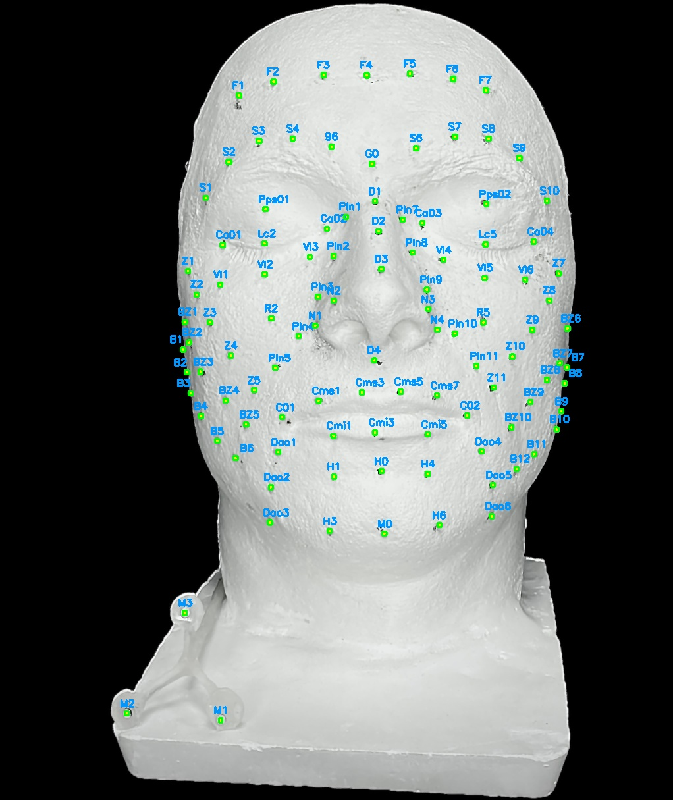

# Facemocap Dataset
Welcome to the GitHub repository for the FaceMoCap dataset. This repository provides some codes to explore the dataset and to exploit some of its functionalities. For a more detailed information, please refer to the article.



## Description
The FaceMoCap dataset provides a novel resource for the analysis and quantification of facial movements. Our dataset includes point cloud sequences that depict a variety of facial gestures from both healthy adults and patients with facial palsy. This dataset has been carefully collected and processed into a readily accessible Python dataframe, offering potential applications in areas such as facial gesture recognition, patient follow-up, and imputation of missing values. 

## Included Facial Gestures
Our dataset covers five specific types of facial movements:

1. Gentle eyelid closure
2. Forced eyelid closure
3. Labial protrusion on "o" sound
4. Labial protrusion on "μou" sound
5. A wide smile

## Access to the Dataset
Due to privacy considerations, the FaceMoCap dataset is not publicly available in this repository. If you wish to gain access to the dataset, please send us an email request detailing your planned usage.

## Getting Started
This repository includes a Python guide that will help you understand and utilize the dataset effectively. In order to use this guide, please clone the repository and install the requirements detailed in the requirements.txt file. 

```bash
git clone https://github.com/eder1234/facemocap_dataset.git
cd facemocap_dataset
pip install -r requirements.txt
```

Once installed, you can navigate the dataset using the included Python tutorial.

## Citation
Pending...

## Contact information
Owner
- Name: Eder Alejandro Rodriguez Martinez
- Email: eder_rdz_mtz@hotmail.com
